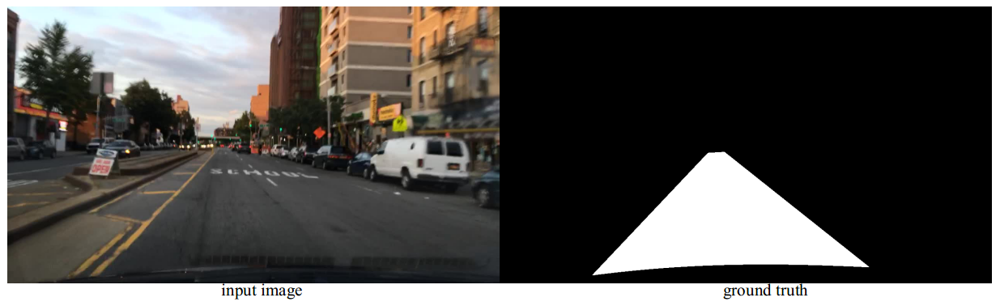

## 当前车道可行驶区域分割

本项目采用的网络模型为mask-rcnn，代码主要来源于开源项目[matterport project](https://github.com/matterport/Mask_RCNN)。在项目中，将驾驶场景图像中的信息按照当前车道'可行驶区域'和'非可行驶区域（即背景类）'进行标注。标注示意图见下图
 
 
 ### 实验环境配置
 #### 1.Requirements
- cudatoolkit9.0                 
- cudnn7.1.2
- python3.6.5                 
- numpy
- cython
- scipy
- Pillow
- matplotlib
- scikit-image==0.13.0
- tensorflow-gpu>=1.3.0
- keras>=2.1.5
- opencv-python
- h5py
- imgaug


 #### 2.使用anaconda配置示例
 
 - 创建envs, 以envs创建名为mask-rcnn为例
 ```buildoutcfg
conda create -n mask-rcnn python==3.6.5
 ```
 - 激活envs
 ```buildoutcfg
source activate mask-rcnn
```
- conda安装Requirements
```buildoutcfg
conda install requirement_name
```
- tips:如果安装过程慢，建议使用中科大源或清华源等。tensorflow建议版本：tensorflow-gpu==1.7.0
```buildoutcfg
conda config --add channels https://mirrors.ustc.edu.cn/anaconda/pkgs/free/
conda config --set show_channel_urls yes
```

- 安装cocoapi
```buildoutcfg
$ git clone https://github.com/cocodataset/cocoapi.git
$ cd coco/PythonAPI
$ make
$ make install
$ python setup.py install
```

### 数据集
数据集来源于[BDD100K](https://bdd-data.berkeley.edu/)中的drivable area，只保留数据集标签中的directly drivable area类，并将数据集格式转换为coco数据集格式。该数据集的目录结构为：

```
drivable
|_ drivable_train2019
|  |_ <im-1-name>.jpg
|  |_ ...
|  |_ <im-N-name>.jpg
|_ drivable_validate2019
|  |_ ...
|_ drivable_test2019
|  |_ ...
|_ annotations
   |_ instances_drivable_train2019.json
   |_ instances_drivable_test2019.json
   |_ instances_drivable_validate2019.json
```
将数据集文件`drivable`放在`data`文件目录下。

### Training
在`mask_rcnn_drivable.py`修改`HOME_DIR`，即该项目存放的地址，`AP.py`和`demo_for_video.py`也需要做相同修改
```buildoutcfg

$ source activate mask-rcnn
$ cd current-lane-drivable-master/mask-rcnn/notebooks
$ python mask_rcnn_drivable.py

```
在`weights`目录下提供了可用于预训练的权值文件`mask_rcnn_drivable_res50.h5`和`mask_rcnn_drivable_res101.h5`，分别作为`BACKBONE`为`resnet50`和`resnet101`预训练权值。

### Test
`AP.py`可计算在不同`IoU`下的检测精度\
 训练与测试图像输入为1024*1024
 
| backbone	| AP（IoU=0.5） 	| AP（IoU=0.75） | model storage（MB）|
| ------------- 		| ------------- | -------------|------------------|
| resnet101  		| 98.4 | 86.6  |  255.9    |
| resnet50 		|  94.2 | 78.2|    179.2   |
|
### Demo

`demo_for_video.py`可处理输入的视频。
修改`HOME_DIR`


### 小结
此实验`BACKBONE`为`resnet`,探索此方法在当前车道进行可行驶区域分割的效果。
道路边缘分割呈现规则的波浪状，模型的mask预测存在改进空间。
 
